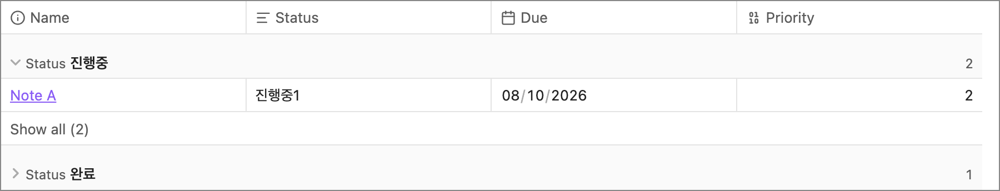
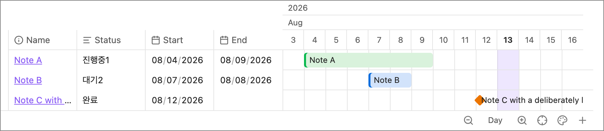
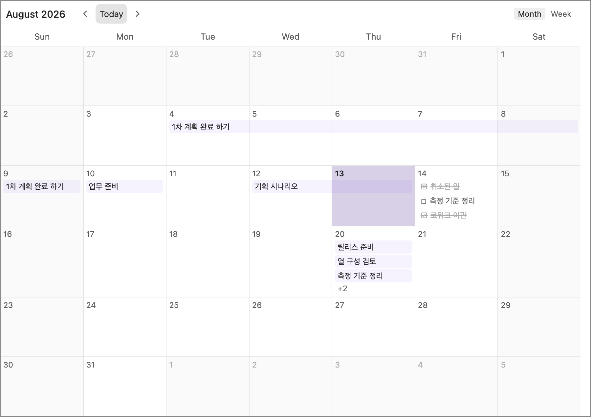
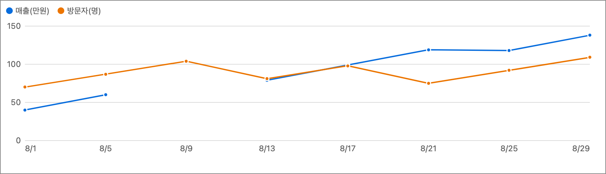

# Bases Plus

Made to fill the gaps in Obsidian's Bases views.

- Makes table, timeline, calendar and graph fully workable in Bases
- This plugin will be discontinued once Obsidian ships similar features natively

[한국어](README.md)

## Install

- Community plugin listing: coming soon
- Manual: copy `main.js`, `manifest.json` and `styles.css` from a release into `.obsidian/plugins/bases-plus/` in your vault, then restart Obsidian
- Then open a base and pick one of the `Plus …` view types. The Bases core plugin must be enabled.

## Shared

- Open targets: modal · new tab · new window
  - Pick the default in settings
  - A modal can promote itself to a new tab or window
- Right-click: `Open with Bases Plus`
  - Enable it in settings
  - The same item is available on the built-in Bases views too

## The four views

### Plus table

- Collapsible groups, manual ordering, whole-table paging, per-group paging

### Plus timeline

- Timeline with a table pane, timeline properties, colors by status
- Adjustable zoom

### Plus calendar

- Title options: a checkbox in front, a status picker behind
- Property chips and tasks on the calendar

### Plus graph

- X-axis windowing, series from visible properties, legend show/hide

## Support

## Data and network

- Collects nothing and never connects to the internet
- Everything happens inside your vault — and there are no ads

## License

[MIT](LICENSE)
