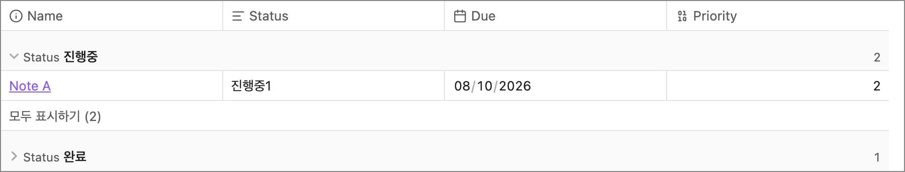
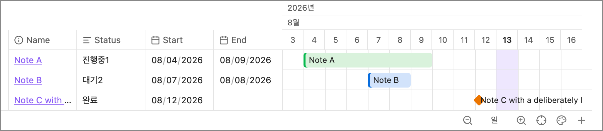
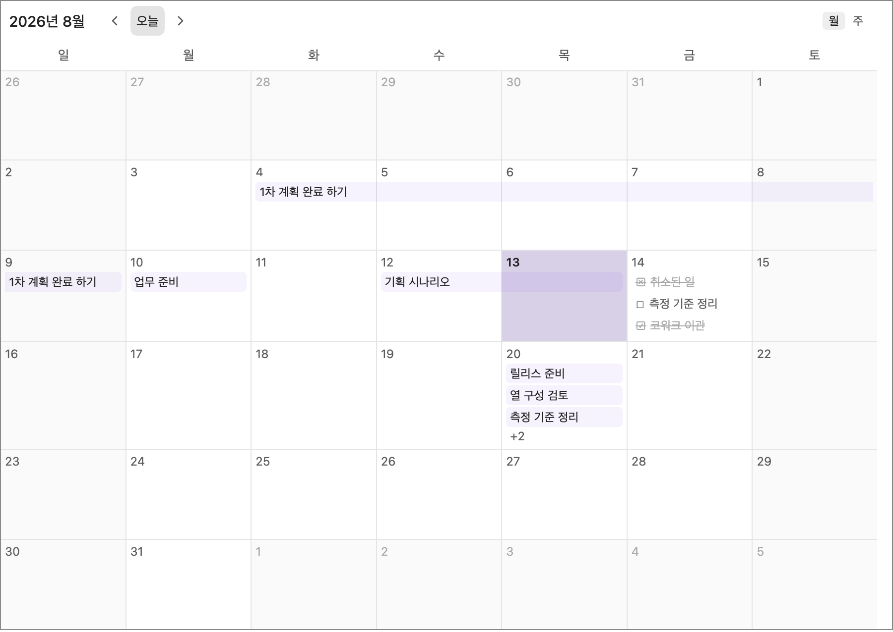
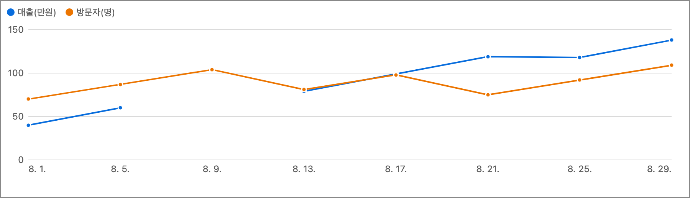

# Bases Plus

옵시디언 Bases 뷰의 부족한 부분을 보완하여 사용하기 위해 만들었습니다

- 최대한 기본 Bases 의 기능을 그대로 취하면서 부족한 기능을 보완합니다
- 표, 타임라인, 달력, 그래프의 기능이 온전히 동작할 수 있도록 하였습니다
- (옵시디언에서 정식으로 비슷한 기능이 수행 가능하면 해당 플러그인은 종료 하려고 합니다)

[English](README.md)

## 설치

- 커뮤니티 플러그인: Obsidian 설정 → 커뮤니티 플러그인에서 `Bases Plus` 를 검색해 설치합니다
- 직접 넣기: 릴리스의 `main.js`, `manifest.json`, `styles.css` 를 볼트의 `.obsidian/plugins/bases-plus/` 에 넣고 Obsidian 을 다시 시작합니다
- 설치 뒤 base 파일을 열고 뷰 종류에서 `플러스 …` 를 고르면 됩니다. Bases 코어 플러그인이 켜져 있어야 합니다.

## 공통

- 열기 방식: 모달 · 새 탭 · 새 창
  - 설정을 통해 기본 열기 선택
  - 모달 안에서 새 탭, 새 창으로 열 수 있습니다
- 우클릭: `Bases Plus 로 열기`
  - 설정에서 활성화
  - 기본 Bases 뷰에서도 같은 항목을 사용할 수 있습니다

## 뷰 4종

### 플러스 표

- 그룹 접기, 수동 순서, 전체 페이징, 그룹 페이징

### 플러스 타임라인

- 타임라인 테이블. 타임라인 속성보기. 상태에 따른 컬러 구분
- 타임라인 배율 수정

### 플러스 달력

- 제목 옵션. 앞 체크박스, 뒤 상태 선택
- 속성 보기, tasks 보기

### 플러스 그래프

- 그래프 범위 지정. 속성을 통해 범례 보기. 범례 보이기/숨기기

## 피드백

- 문제나 개선 의견은 [GitHub 이슈](https://github.com/kim109238/obsidian-bases-plus/issues)나 이메일(kim109238@gmail.com)로 보내주세요
- 플러그인은 2주 주기로 정비합니다 — 피드백을 모아 두었다가 주기 마지막 2일에 수정합니다

### 다음 v1.1

- 모달에서 날짜 등 속성을 조작할 때 죽는 문제
- 달력에서 tasks 를 눌러도 해당 노트가 열리지 않는 문제
- 타임라인 그룹의 + 버튼으로 파일이 생성되지 않는 문제
- 표에서 목록 속성 값을 기본 기능처럼 바로 선택해 입력
- 타임라인 주 단위(토·일) 구분 표시
- 그래프 y 축 범위 지정

## 후원

## 수집·네트워크

- 아무 데이터도 모으지 않고, 인터넷에 연결하지 않습니다
- 모든 동작은 볼트 안에서만 일어나고, 광고도 없습니다

## 라이선스

[MIT](LICENSE)
